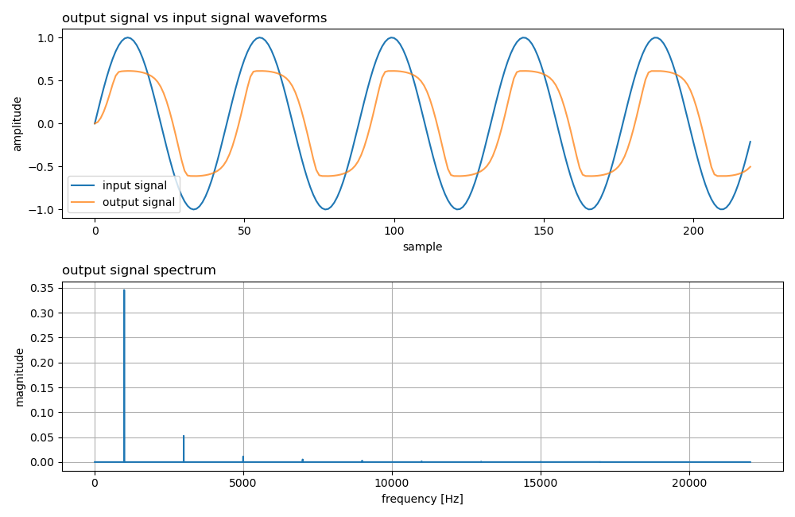
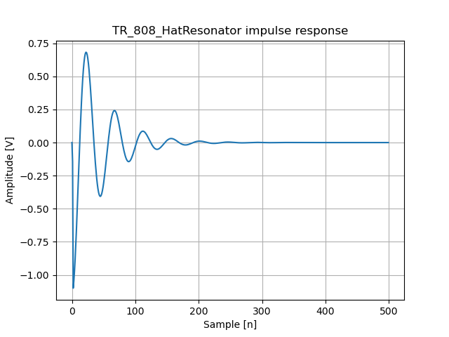

# pywdf

[](https://repositori.upf.edu/handle/10230/57903)


<code>pywdf</code> is a Python framework for modeling and simulating wave digital filter circuits. It allows users to easily create and analyze WDF circuit models in a high-level, object-oriented manner. The library includes a variety of built-in components, such as voltage sources, capacitors, diodes etc., as well as the ability to create custom components and circuits. Additionally, pywdf includes a variety of analysis tools, such as frequency response and transient analysis, to aid in the design and optimization of WDF circuits. Also included are several example circuits as shown below. 

## Installation
```
pip install git+https://github.com/gusanthon/pywdf
```

## Structure
The <code>core</code> directory contains the main source code of the repository. Basic WDF elements and adaptors are contained in <code>wdf.py</code>, adapted and unadapted R-Type adaptors are contained in <code>rtype.py</code>, and the circuit class and functionalities for examples are contained in <code>circuit.py</code>.
```
├── pywdf
│   ├── core
│   │   ├── circuit.py
│   │   ├── rtype.py
│   │   └── wdf.py
│   └── examples
│       ├── bassmantonestack.py
│       ├── baxandalleq.py
│       ├── diodeclipper.py
│       ├── lc_oscillator.py
│       ├── passivelpf.py
│       ├── rca_mk2_sef.py
│       ├── rclowpass.py
│       ├── sallenkeyfilter.py
│       ├── tr_808_hatresonator.py
│       └── voltagedivider.py
├── requirements.txt
├── setup.py
```

## Usage

```python
from pywdf import RCA_MK2_SEF, DiodeClipper, TR_808_HatResonator

# sweep positions of RCA mk2 SEF low pass filter knob and plot frequency responses
mk2_sef = RCA_MK2_SEF(44100, 0, 3000)
positions = range(1,11)
mk2_sef.plot_freqz_list(positions, mk2_sef.set_lowpass_knob_position, param_label = 'lpf knob pos')
```


```python
# analyze transient response of Diode Clipper to AC signal
dc = DiodeClipper(44100, cutoff= 1000, input_gain_db = 5)
dc.AC_transient_analysis()
```


```python
# visualize impulse response of TR-808 hat resonator
hr = TR_808_HatResonator(44100, 1000, .5)
hr.plot_impulse_response(outpath='pywdf/figures/hat_res_IR.png')
```


Here there is a [collab tutorial](https://colab.research.google.com/drive/1bfgziD84lgcbKcin0sw5IwgwcT32akRd?usp=sharing) to show you some examples of usage.

## Citation
If you use this library for WDF prototyping, please cite the [DAFx23 conference paper](https://repositori.upf.edu/handle/10230/57903) using the following reference:
```
@article{anthon_pywdf_2023,
	title = {{PYWDF}: an open source library for prototyping and simulating wave filter circuits in {Python}},
	copyright = {© 2023 Gustav Anthon, Xavier Lizarraga-Seijas and Frederic Font. This is an open-access article distributed under the terms of the Creative Commons Attribution 4.0 International License, which permits unrestricted use, distribution, adaptation, and reproduction in any medium, provided the original author and source arecredited.},
	issn = {2413-6689},
	shorttitle = {{PYWDF}},
	url = {http://repositori.upf.edu/handle/10230/57903},
	abstract = {This paper introduces a new open-source Python library for the modeling and simulation of wave digital filter (WDF) circuits. The library, called pwydf, allows users to easily create and analyze 
WDF circuit models in a high-level, object-oriented manner. The library includes a variety of built-in components, such as voltage sources, capacitors, diodes etc., as well as the ability to create custom components and circuits. Additionally, pywdf includes a variety of analysis tools, such as frequency response and transient 
analysis, to aid in the design and optimization of WDF circuits. We demonstrate the library’s efficacy in replicating the nonlinear behavior of an analog diode clipper circuit, and in creating an allpass filter that cannot be realized in the analog world. The library is well-documented and includes several examples to help users get started. Overall, pywdf is a powerful tool for anyone working with WDF circuits, and we hope it can be of great use to researchers and engineers in the field.},
	language = {eng},
	urldate = {2023-09-20},
	author = {Anthon, Gustav and Lizarraga Seijas, Xavier and Font Corbera, Frederic},
	year = {2023},
	note = {Accepted: 2023-09-18T12:02:53Z
Publisher: Aalborg University Copenhagen},
	file = {Full Text PDF:files/189/Anthon et al. - 2023 - PYWDF an open source library for prototyping and .pdf:application/pdf},
}
```

## For more information

Based on Jatin Chowdhury's C++ [WDF library](https://github.com/Chowdhury-DSP/chowdsp_wdf)  

Developed from work done in master thesis [Evaluating the Nonlinearities of A Diode Clipper Circuit Based on Wave Digital Filters](https://zenodo.org/record/7116075) 

For further reading, check out:

- Alfred Fettweis, "Wave Digital Filters: Theory and Practice", 1986, IEEE Invited Paper [[URL]](https://ieeexplore.ieee.org/stamp/stamp.jsp?arnumber=1457726)
- Kurt Werner, "Virtual Analog Modeling of Audio Circuitry Using Wave Digital Filters", PhD. Dissertation, Stanford University, 2016 [[URL]](https://stacks.stanford.edu/file/druid:jy057cz8322/KurtJamesWernerDissertation-augmented.pdf)  
- Giovanni De Sanctis and Augusto Sarti, “Virtual analog modeling in the wave-digital domain,” IEEE transactions on audio, speech, and language processing, vol. 18, no. 4, pp. 715–727, 2009. [[URL]](https://ieeexplore.ieee.org/abstract/document/5276845)
- Kurt James Werner, Vaibhav Nangia, Julius O Smith, and Jonathan S Abel, “A general and explicit formulation for wave digital filters with multiple/multiport nonlinearities and complicated topologies,” IEEE, 2015, pp. 1–5. [[URL]](https://ieeexplore.ieee.org/document/7336908)
- D. Franken, Jörg Ochs, and Karlheinz Ochs, “Generation of wave digital structures for networks containing multiport elements,” Circuits and Systems I: Regular Papers, IEEE Transactions on, vol. 52, pp. 586 – 596, 04 2005. [[URL]](https://www.researchgate.net/publication/4018571_Generation_of_wave_digital_structures_for_connection_networks_containing_ideal_transformers)


## Contributions
We welcome contributions to this project from anyone interested in helping out. If you notice a bug or would like to request a new feature, please open an Issue and we'll take a look as soon as possible.
